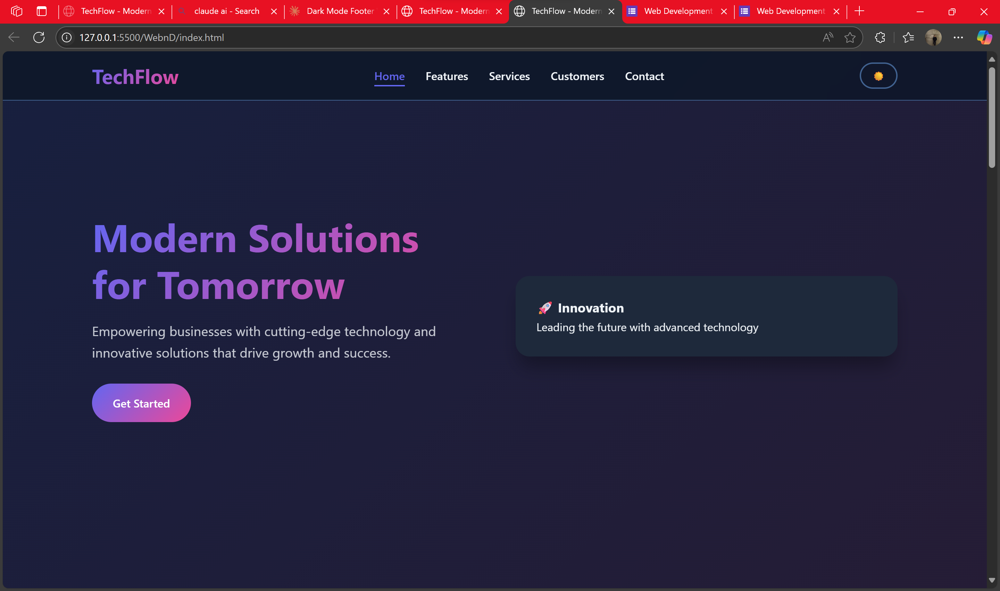

💻 <h1>TechFlow – Modern Solutions for Tomorrow</h1> 
Welcome to TechFlow, a modern, responsive, and feature-rich front-end project designed to showcase interactive web development techniques and elegant UI/UX design patterns.

🌟 Live Demo
🔗 https://manish731315.github.io/WebnD/

├── index.html       # Main HTML structure
├── style.css        # Responsive and modern CSS styling
└── script.js        # Interactive and dynamic JavaScript functionality

✨<h2> Key Features</h2>
<ul>
  <li>⚡ Animated Loader with percentage progress</li>
   <li>🌓 Light/Dark Theme Toggle with localStorage support</li>
   <li>📱 Fully Responsive design for all devices</li>
   <li>🧭 Smooth Scroll & Active Nav Highlighting</li>
   <li>🎠 Interactive Carousel with autoplay and navigation</li>
   <li>🎨 Modern UI/UX with floating cards, ripple effects, and scroll animations</li>
   <li>💬 Customer Testimonial Section</li>
   <li>🔧 Customizable Sections for Features and Services</li>
   <li>📩 Popup Modal for user engagement</li>
   <li>🌐 Clean, semantic HTML and well-organized CSS and JS</li>
</ul>

<h2>🧠 Technologies Used</h2>
 
<ul>
  <li>HTML5</li>
  <li>CSS3 (Custom Properties, Media Queries, Animations)</li>
  <li>JavaScript (ES6+, DOM API, IntersectionObserver)</li>
</ul>

<h3>📸 Screenshots</h3>

<h2>📦 How to Use</h2>
<h3>🖥️ View Online (Recommended)</h3>
Simply visit the Live Demo in your browser.

<h3>💻 Run Locally</h3>
Clone the repository

bash
git clone https://github.com/your-username/TechFlow.git
cd TechFlow
Open the project

Open index.html in your web browser
(You can double-click it or open it with VS Code + Live Server extension)

<h3>⚙️ Customize</h3>
Update content directly in index.html

Change styles in style.css

Add/modify interactivity via script.js

🧪 Optional: Use Live Server (VS Code)
If you're using Visual Studio Code:

Install the Live Server extension

Right-click index.html > Open with Live Server

